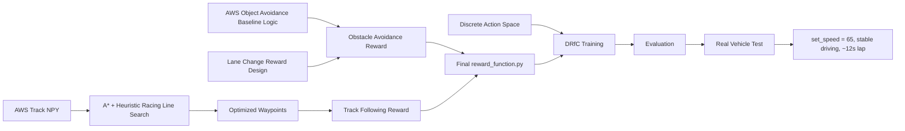

# AWS DeepRacer 강화학습 보상함수 설계 및 최적화

## 개요

이 저장소는 AWS DeepRacer 경진대회 워크스페이스에서 제가 직접 담당한 `reward_function.py` 설계와 튜닝 과정을 정리한 포트폴리오 문서입니다.

프로젝트 전체에는 클라우드 학습 인프라, 차량 API, 하드웨어 적용 실험이 함께 포함되어 있지만, 제 담당 범위는 `drfc-aws-main/reward_function.py`를 중심으로 한 보상함수 설계와 그에 맞춘 주행 로직 최적화였습니다.

제가 설계한 최종 보상함수는 다음 두 접근을 결합한 결과입니다.

- `yj`의 A* + 휴리스틱 기반 최적화 트랙 주행 로직
- `jh`의 AWS 기본 Object Avoidance 코드 변형 + 차선 변경 보상 로직

이 두 접근을 합쳐 최적 레이싱 라인을 안정적으로 따라가면서도 장애물을 회피할 수 있는 보상함수로 정리했고, 해당 세팅으로 장려상을 수상했습니다. 실차 기준 `set_speed = 65`에서 안정적으로 주행 가능했고, 랩타임은 대략 12초대였습니다.

## 담당 범위

| 영역 | 파일 | 구현한 내용 |
|---|---|---|
| Reward Design | [`drfc-aws-main/reward_function.py`](drfc-aws-main/reward_function.py) | 최종 대회용 보상함수 설계, 최적 경로 추종 보상, 장애물 회피 보상, 차선 변경 보상 로직 통합 |
| Reward Research | [`aws_obj/obj_astar_reward.ipynb`](aws_obj/obj_astar_reward.ipynb) | 트랙 `.npy` 분석, A* + 휴리스틱 기반 레이싱 라인 탐색, 속도 프로파일 실험, 보상함수 프로토타이핑 |
| Training Spec | [`drfc-aws-main/02_Setup.ipynb`](drfc-aws-main/02_Setup.ipynb) | 보상함수와 함께 사용할 discrete action space 및 학습 메타데이터 정리 |

## 담당 범위 제외

아래 항목들은 저장소에 포함되어 있지만 제 직접 담당 범위는 아니었습니다.

- EC2, S3, IAM 등 DRfC 클라우드 인프라 운영
- 학습 인스턴스 기동 및 배포 자동화
- 차량 API 튜토리얼 및 별도 하드웨어 제어 실험
- GPT / Ollama 기반 실험 노트북

## 시스템 목표

이 보상함수는 AWS DeepRacer의 Object Avoidance 환경에서 다음 목표를 동시에 만족하도록 설계되었습니다.

- A*와 휴리스틱으로 얻은 최적 레이싱 라인을 최대한 안정적으로 추종
- 장애물 구간에서 단순 감속이 아니라 안전한 차선 변경 유도
- steering 오차를 줄여 zig-zag를 줄이고 progress를 안정적으로 확보
- discrete action space와 결합해 corner와 obstacle 상황에 맞는 속도 선택 유도

## End-To-End 파이프라인



## 주요 기능

### 1. A* 기반 최적 레이싱 라인 추종

- DeepRacer 트랙 `.npy` 데이터에서 중심선과 경계 정보를 읽어 주행 가능한 레이싱 라인을 구성
- A*와 휴리스틱을 사용해 더 빠르고 안정적인 경로를 탐색
- 최종 보상함수에서는 현재 차량 위치 기준 목표 waypoint를 바라보도록 구성하여 steering 오차를 줄이도록 설계

### 2. 장애물 회피 보상

- AWS에서 기본 제공하는 Object Avoidance 보상 구조를 그대로 쓰지 않고 트랙 특성에 맞게 수정
- 장애물 위치와 차선 상황을 고려해 더 자연스럽게 회피하도록 보상 항목 조정
- 단순 off-track 방지 수준이 아니라 실제 주행 품질을 높이는 방향으로 튜닝

### 3. 차선 변경 보상 추가

- 장애물 회피 시 lane choice를 더 명확하게 유도하기 위해 차선 변경 관련 보상 항목 추가
- 회피 후 다시 안정적인 주행 라인으로 복귀하도록 설계
- obstacle 구간에서 steering이 과도하게 흔들리는 문제를 줄이는 데 초점을 둠

### 4. Action Space와의 공동 최적화

- 보상함수만 따로 튜닝하지 않고 discrete action space와 함께 조정
- 직선에서는 빠른 속도 선택이 가능하고, 급코너 및 회피 구간에서는 낮은 속도와 큰 steering 조합이 가능하도록 구성
- reward와 action distribution을 함께 맞춰 실제 차량에서도 안정성을 확보

## 액션 스페이스 요약

최종 학습에는 discrete action space를 사용했습니다.

- action 개수: `21`
- steering 범위: `-30.0 ~ 30.0`
- speed 범위: `1.3 ~ 3.7544`
- 특징:
  - 직진 및 완만한 구간용 고속 action 포함
  - 회피 및 급조향 구간용 저속 action 포함
  - steering과 speed를 독립적으로 크게 벌리지 않고 실제 추종 가능한 조합 위주로 구성

<details>
<summary>사용한 action space 전체 보기</summary>

```python
from aicastle.deepracer.drfc.aws import drfc
drfc.set_model_metadata({
    "action_space": [
        {"steering_angle": 6.6347, "speed": 2.3099},
        {"steering_angle": 3.8378, "speed": 3.7494},
        {"steering_angle": 12.5795, "speed": 1.6743},
        {"steering_angle": 0.0256, "speed": 3.1353},
        {"steering_angle": 0.7976, "speed": 1.3572},
        {"steering_angle": -1.2044, "speed": 2.2898},
        {"steering_angle": 1.8639, "speed": 2.7392},
        {"steering_angle": 11.7137, "speed": 1.3335},
        {"steering_angle": 4.2553, "speed": 1.6776},
        {"steering_angle": 23.2229, "speed": 1.3321},
        {"steering_angle": -11.6405, "speed": 2.2051},
        {"steering_angle": 17.4536, "speed": 2.2852},
        {"steering_angle": 9.5605, "speed": 1.9713},
        {"steering_angle": -0.8296, "speed": 1.9318},
        {"steering_angle": 14.3511, "speed": 2.8269},
        {"steering_angle": -11.2569, "speed": 2.7161},
        {"steering_angle": 22.1874, "speed": 1.7366},
        {"steering_angle": -9.8472, "speed": 3.7544},
        {"steering_angle": -8.0276, "speed": 1.6672},
        {"steering_angle": 30.0, "speed": 1.3},
        {"steering_angle": -30.0, "speed": 1.3},
    ],
})
```

</details>

## 파일별 요약

### `drfc-aws-main/reward_function.py`

이 파일은 제가 직접 담당한 핵심 산출물입니다. 최종 대회용 보상함수이며, 최적 레이싱 라인 추종과 장애물 회피를 하나의 reward 설계로 통합한 결과물입니다.

- 입력: DeepRacer `params`
- 출력: 스칼라 reward
- 핵심 역할:
  - 목표 주행 라인 추종 유도
  - steering 오차 감소
  - obstacle 상황에서 lane choice 유도
  - 안정성과 랩타임 간 균형 확보

### `aws_obj/obj_astar_reward.ipynb`

이 노트북은 최적화 트랙 주행 로직을 만들기 위한 연구용 파일입니다.

- 트랙 `.npy` 로드 및 경계 분석
- A* + 휴리스틱 기반 레이싱 라인 탐색
- 속도 프로파일 계산
- reward 구조 실험 및 검증

### `drfc-aws-main/02_Setup.ipynb`

이 노트북은 최종 보상함수와 함께 사용할 학습 메타데이터를 설정하는 파일입니다.

- reward function 업로드
- model metadata 설정
- discrete action space 설정
- hyperparameter 및 환경 설정

## 저장소 구조

```text
.
├── drfc-aws-main
│   ├── reward_function.py
│   ├── 02_Setup.ipynb
│   └── 03_Training.ipynb
├── aws_obj
│   └── obj_astar_reward.ipynb
└── deepracer-vehicle-api-main
    └── ... 차량 API 및 기타 실험 노트북
```

## 이 저장소를 읽는 순서

제 담당 범위만 빠르게 확인하려면 아래 순서로 보면 됩니다.

1. [`drfc-aws-main/reward_function.py`](drfc-aws-main/reward_function.py)
2. [`aws_obj/obj_astar_reward.ipynb`](aws_obj/obj_astar_reward.ipynb)
3. [`drfc-aws-main/02_Setup.ipynb`](drfc-aws-main/02_Setup.ipynb)

## 기술 스택

- AWS DeepRacer
- DeepRacer for Cloud (DRfC)
- Python
- Jupyter Notebook
- NumPy
- Shapely
- A* Search
- Heuristic Path Planning
- Reinforcement Learning Reward Design

## 결과

- 2024 AWS DeepRacer 챔피언십 리그 장려상
- 최종 보상함수 설계 및 튜닝 완료
- `set_speed = 65`에서 안정적 주행 확인
- 대략 12초대 랩타임 확보

## 요약

이 프로젝트에서 저는 AWS DeepRacer 워크스페이스 전체 중 `reward_function.py` 설계와 최적화에 집중했습니다.

- A* + 휴리스틱 기반 최적 레이싱 라인 주행 보상 설계
- AWS 기본 Object Avoidance 코드 변형
- 차선 변경 보상 추가
- discrete action space와 보상함수 공동 최적화
- 실차에서 안정성과 랩타임을 동시에 확보


## 프로젝트 영상

<주행 테스트 영상>


https://github.com/user-attachments/assets/1e4781c5-095d-48cf-8009-3d4356a5324a

