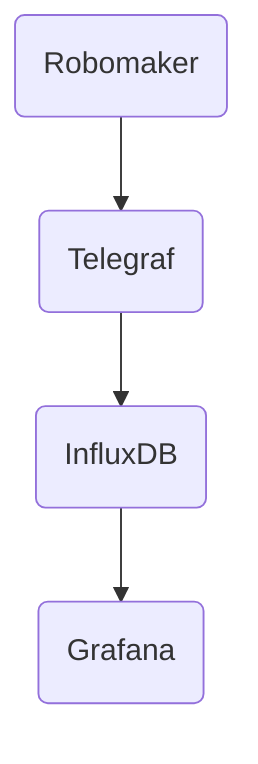

# 실시간 메트릭

선택적인 telegraf/influxdb/grafana 스택을 사용하여 실시간 메트릭을 수집하고 시각화할 수 있습니다.

이 기능을 활성화하면 Robomaker 컨테이너가 UDP 메트릭을 Telegraf로 전송하며, Telegraf는 메트릭을 강화하고 InfluxDB 시계열 데이터베이스 컨테이너에 저장합니다.

Grafana는 대화형 대시보드를 위한 프레젠테이션 레이어를 제공합니다.

## 초기 설정 및 시작

이 기능을 활성화하려면 system.env 파일에서 `DR_TELEGRAF_HOST`와 `DR_TELEGRAF_PORT`의 주석을 해제하십시오. 대부분의 경우 기본값이 수정 없이 작동해야 합니다.

`dr-start-metrics`를 사용하여 메트릭 도커 스택을 시작하십시오.

실행 중인 경우 Grafana는 포트 3000을 통해 웹 브라우저에서 접근할 수 있어야 합니다. 예를 들어 http://localhost:3000
기본 사용자 이름은 `admin`, 비밀번호는 `admin`입니다. 첫 로그인 시 자신의 비밀번호를 설정하라는 메시지가 표시됩니다.

*참고: Grafana는 처음 시작할 때 초기 내부 설정을 수행하는 데 60-90초가 걸릴 수 있습니다. 이 작업이 완료될 때까지 웹 UI는 사용할 수 없습니다. 필요하다면 grafana 컨테이너 로그를 확인하여 상태를 확인할 수 있습니다.*

메트릭 스택은 중지(`dr-stop-metrics`)되거나 기계가 재부팅될 때까지 실행 상태를 유지합니다. 훈련 실행 사이에 다시 시작할 필요가 없으며 새로운 모델의 메트릭을 자동으로 수집해야 합니다.

## 대시보드 사용

기본 deepracer 메트릭에 접근하는 방법을 보여주는 템플릿 대시보드가 제공됩니다. 이 대시보드를 기반으로 자신만의 맞춤형 대시보드를 구축할 수 있습니다.

브라우저로 Grafana 웹 UI에 연결한 후 메뉴를 사용하여 대시보드 섹션으로 이동하십시오.

`DeepRacer Training template`이라는 템플릿 대시보드가 보일 것이며, 보상, 진행 상황 및 완료된 랩 타임의 그래프를 보여줍니다.

이것은 자동으로 제공된 대시보드이므로 변경 사항을 저장할 수는 없지만, 작은 톱니바퀴 아이콘을 클릭하여 대시보드 설정 페이지로 들어간 다음 `다른 이름으로 저장`을 클릭하여 편집 가능한 복사본을 만들 수 있습니다.

대시보드를 사용하는 방법에 대한 전체 사용자 가이드는 [Grafana 웹사이트](https://grafana.com/docs/grafana/latest/dashboards/use-dashboards/)에서 확인할 수 있습니다.

## 문서

* [인트로](index.md)
* [초기 설치](installation.md)
* [AWS 콘솔에 모델 업로드](upload.md)
* [환경 변수 및 명령어](reference.md)
* [다중 Robomaker 작업자 사용](multi_worker.md)
* [다중 병렬 실행](multi_run.md)
* [Robomaker를 위한 GPU 가속 OpenGL](opengl.md)
* [하나의 컴퓨터에서 여러 GPU 사용](multi_gpu.md)
* [Windows에 설치하기](windows.md)
* [Head to Head 레이스 실행](head-to-head.md)
* [자동차 관찰하기](video.md)
* [Docker 설정에 대하여](docker.md)
* [실시간 지표](metrics.md)